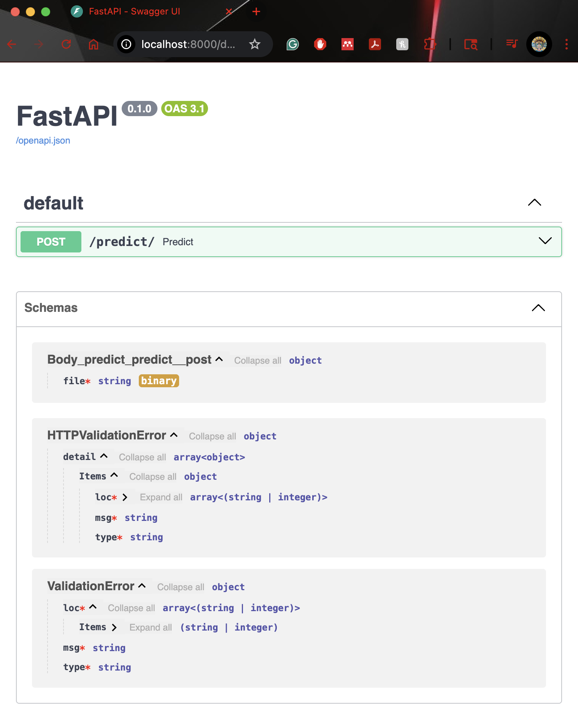
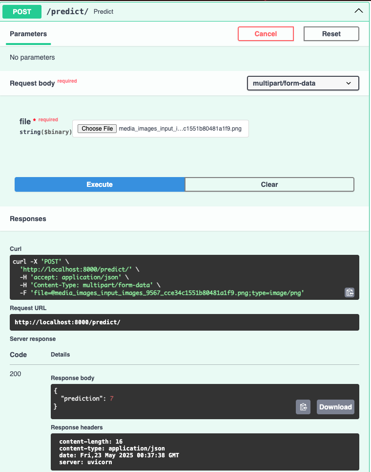

# MLOps-final-assignment

## Project Overview

The objective of this project is to:
- train a MNIST classifer model 
- log and monitor with Weights and Biases
- Serve model as service with FastAPI application
- Containerize the deployment

The development of the model was done in a python3.10 docker container. I built a simple 2-layer MLP for classifying MNIST 28x28 image data into 10 classes based on the number present in the image. The model has been trained for 20 epoches with a learning rate of 0.001. I used Weights and Biases to track/monitor the logs. The metrics that were logged are training loss, learning rate, gradient norms, validation accuracy, precision and recall. Only the last model checkpoint was saved. 

## Instructions for running the code locally

Install required python packages with requirement.txt before running the code.

1. Train the model:
    ```bash
    python3 train.py
    ```

2. Serve model with FastAPI application:
    ```bash
    python3 fastapi_app.py
    ```

## Instructions for building and running the Docker container

1.  Build the Docker image:
    ```bash
    docker build -t mnist-fastapi-app:latest .
    ```
    This command builds a Docker image from the `Dockerfile` in the current directory (`.`) and tags it with the name `mnist-fastapi-app:latest`.

2.  Run the Docker container:
    ```bash
    docker run -p 8000:8000 mnist-fastapi-app:latest
    ```
    This command runs the `mnist-fastapi-app:latest` image. `-p 8000:8000` maps port 8000 of the host machine to port 8000 of the container.

3.  Access the application:
    After the container is running, you should be able to access your FastAPI application by navigating to `http://localhost:8000` in your web browser or using a tool like `curl` or Postman to send requests to `http://localhost:8000/predict/`.

    Navigating to `http://localhost:8000/docs` gives your documentation of using the hosted model URL.

    Here are some screenshots:
    <p align="center">
        
        
    </p>

## URL for the wandb report

- View wandb run at: https://wandb.ai/sudhir-sornapudi-corteva-agriscience/mnist-mlops-project/runs/xu4j3fij
- Find wandb logs at: ./wandb/run-20250523_024415-xu4j3fij/logs

## CI/CD Pipeline

I did not include this part as I did it with GitLab using Corteva resources for hosting the app.
